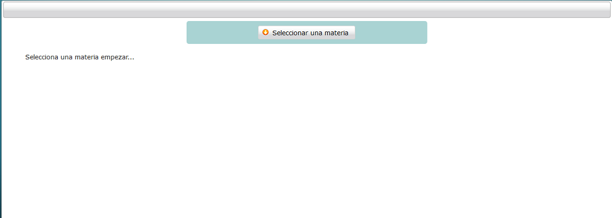
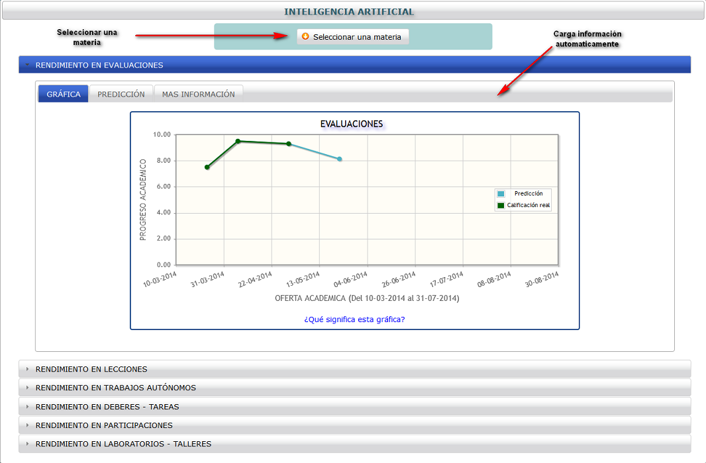
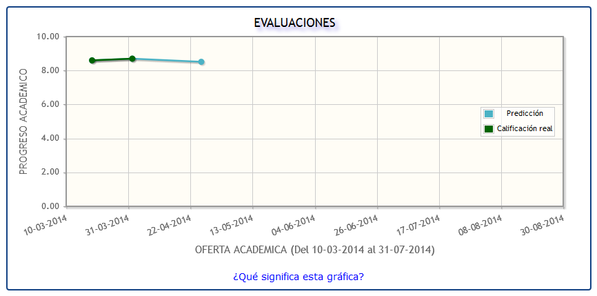
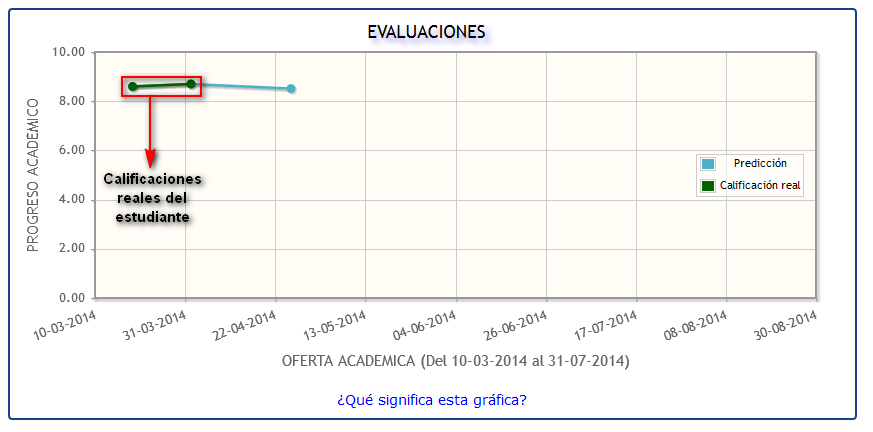
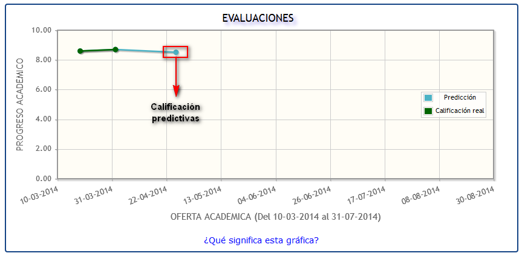
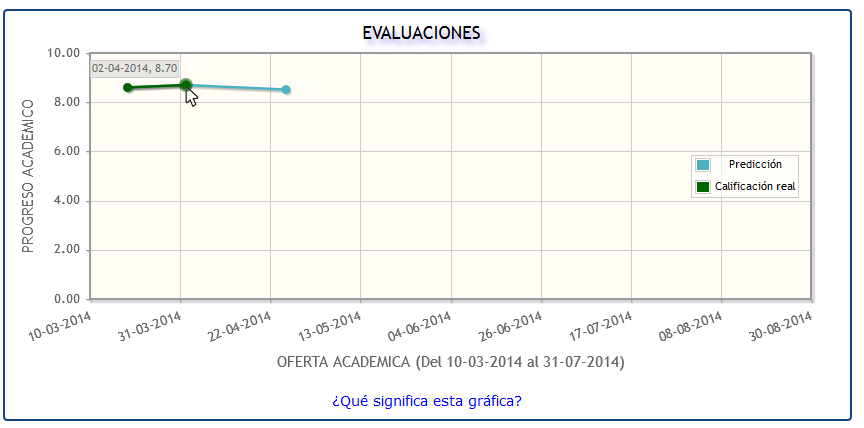
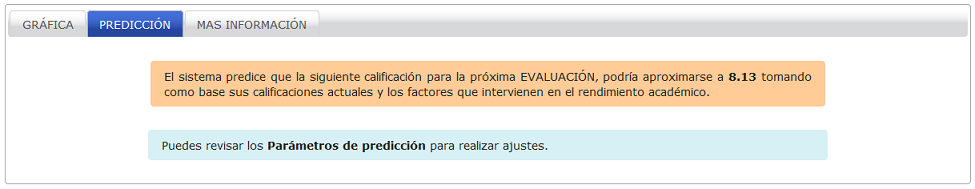
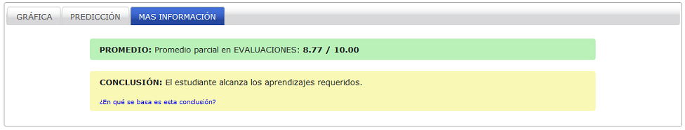

.. _generateGraph-title:

**********************
Generación de gráficas
**********************

Dan una visión clara al estudiante sobre como va su desempeño académico actual y futuro mediante gráficas de predicción.

.. _generateGraph-graphics_ok:

Proceso para generación de gráficas
===================================

Una vez que se ha seleccionado el módulo sobre el cual se desean recuperar datos (ver :ref:`selectModule-title`) el sistema presenta la vista de generación de gráficas como se aprecia en la imagen

.. _generateGraph-img-generateGraph_no_graphics:

    **Vista para generación de gráficas**

En primera instancia la sección de gráficas se encuentra vacía por lo que es necesario seleccionar una materia para presentar las gráficas de desempeño y predicción. En la siguiente imagen se describe de manera visual, el proceso a seguir.

.. _generateGraph-img-generateGraph_proccess_graphics:

    **Proceso para generación de gráficas**

Cabe resaltar que se generan gráficas para cada uno de los parámetros de calificación (evaluaciones, lecciones, deberes, etc.) dependiendo de la cantidad de aportes que el docente haya especificado.

.. note::
	Para conseguir información detallada de las calificaciones reales obtenidas hasta la fecha ir al apartado :ref:`qualificationDetail-title`

.. _generateGraph-graphics_structure:

Estructura de las gráficas
==========================

Como se aprecia en la imagen siguiente se utilizan gráficas de líneas que tiene una relación entre tiempo académico y calificación del estudiante para medir visualmente el avance.

.. _generateGraph-img-generateGraph_graph_example:

    **Ejemplo de gráfica generada**

La línea que indica como avanza el desempeño académico del estudiante (color verde) se basa en calificaciones reales obtenidas por el mismo y que ya han sido subidas al sistema por el docente en distintas fechas.

.. _generateGraph-img-generateGraph_graph_info_complete:

    **Gráfica rendimiento y predicción 1**

La siguiente línea es para la calificación que predice el sistema (color celeste) y su relación con respecto a las actuales a más de una fecha tentativa en la cual se podría llevar a cabo dicho aporte.

.. _generateGraph-img-generateGraph_graph_info_complete2:

    **Gráfica rendimiento y predicción 2**

Para mayor información se puede pasar el cursor sobre cada punto como se aprecia en la imagen:

.. _generateGraph-img-generateGraph_graph_more_info:

    **Más información en gráficas**

.. _generateGraph-graphics_prediction:

Predicción
==========

Una vez generadas las gráficas, se aprecia una pestaña denominada predicción la cual presenta de una manera textual y más clara la calificación que ha generado el sistema:

.. _generateGraph-img-generateGraph_prediction:

    **Calificación predictiva**

Para realizar la predicción se utiliza información relacionada con las calificaciones previamente obtenidas y los factores que influyen en el rendimiento académico configurados por el estudiante (ver aparatado :ref:`factors-title`)

.. _generateGraph-graphics_more_info:

Mas información
===============

Esta opción presenta detalles sobre el promedio parcial en determinado parámetro a más de una conclusión tomada de la actual `ley de educación <http://www.educar.ec/servicios/regla_loei-6.html>`_.

.. _generateGraph-img-graphics_more_info:

    **Calificación predictiva**

.. note::
	Para conseguir información detallada de las calificaciones reales obtenidas hasta la fecha se debe seleccionar el botón **Ver mis calificaciones actuales**. Para más información ir al apartado :ref:`qualificationDetail-title`
