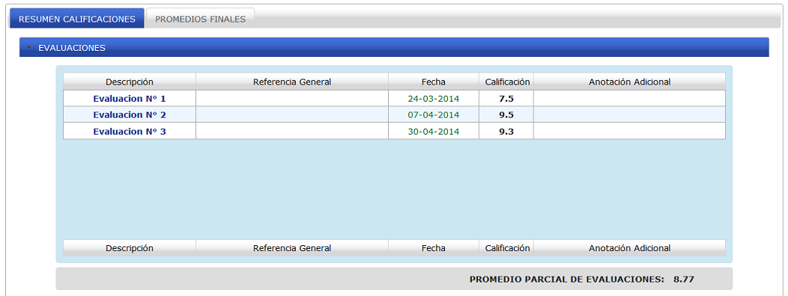

.. _qualificationDetail-title:

**********************************
Calificaciones y promedios finales
**********************************

Una vez generadas las gráficas (ver :ref:`generateGraph-title`) y posteriormente que se ha ingresado a la sección de calificaciones detalladas y promedios, se presentan estas opciones con información para el estudiante. Dichas calificaciones y promedios son generados con calificaciones reales que han sido ingresadas por el docente.

.. _qualificationDetail-detail:

Calificaciones detalladas
=========================

En esta opción se presentan a detalle las calificaciones del estudiante, cada aporte se encuentra separado según el parámetro de evaluación al cual pertenezca (Evaluaciones, lecciones, deberes, etc.). En la parte inferior de la traba se presenta un promedio parcial perteneciente a cada parámetro como se aprecia en la imagen

.. _qualificationDetail-img-qualificationDetail_summary:

    **Resumen de calificaciones**

.. _qualificationDetail-average:

Resumen de calificaciones
=========================

Esta puede ser considerada como una de las secciones de más interés para el estudiante ya que se presentan los promedios finales. Cada parámetro con su porcentaje (peso) a la nota final fue configurado por el docente en mutuo acuerdo con sus educandos. 
Como se precia en la imagen se presenta información lo más detallada posible para un mejor entendimiento del estudiante.

.. _qualificationDetail-img-qualificationDetail_average:

    **Promedios finales**